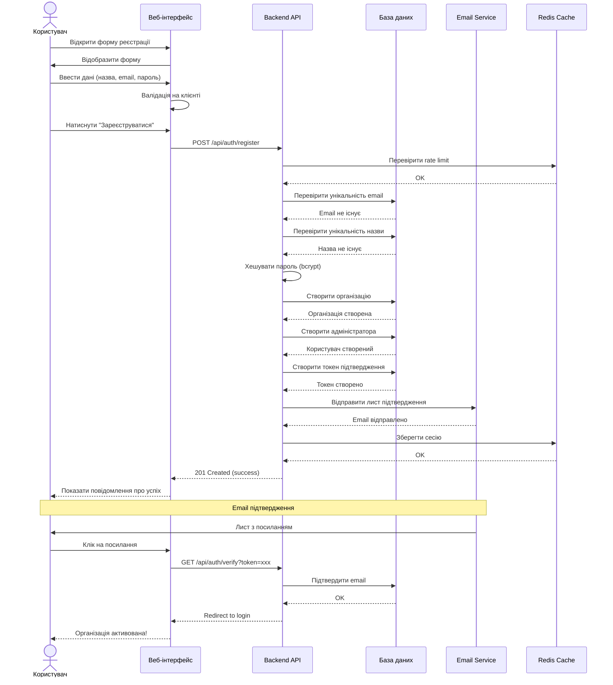

# Таблиця сценаріїв вебзастосунку

## Сценарій реєстрації організації

| № | Назва та код сценарію | Опис сценарію |
|---|---|---|
| 1 | **Назва:** Реєстрація організації<br>**Код:** SC-REG-ORG-001<br>**Актори:** Незареєстрований користувач, Система<br>**Пріоритет:** 1<br>**Частота:** Низька (1-2 рази на тиждень) | **Дія:** Створення облікового запису організації в системі<br><br>**Попередні умови:**<br>- Користувач має доступ до інтернету<br>- Користувач має дійсну електронну адресу<br>- Організація не зареєстрована в системі<br><br>**Подальші умови:**<br>- Створено обліковий запис організації<br>- Створено обліковий запис адміністратора<br>- Відправлено лист для підтвердження email<br>- Організація має статус "неактивна" до підтвердження<br><br>**Нормальна послідовність:**<br>1. Користувач відкриває сторінку реєстрації<br>2. Система відображає форму реєстрації<br>3. Користувач вводить назву організації, email, пароль<br>4. Користувач підтверджує пароль<br>5. Користувач натискає "Зареєструватися"<br>6. Система валідує введені дані<br>7. Система створює організацію та адміністратора<br>8. Система відправляє лист підтвердження<br>9. Система відображає повідомлення про успішну реєстрацію<br>10. Користувач переходить до підтвердження email<br><br>**Альтернативний хід:**<br>- 6а. Email вже зареєстрований:<br>&nbsp;&nbsp;- Система відображає помилку "Email вже використовується"<br>&nbsp;&nbsp;- Користувач повертається до кроку 3<br>- 6b. Назва організації вже існує:<br>&nbsp;&nbsp;- Система відображає помилку "Організація з такою назвою вже існує"<br>&nbsp;&nbsp;- Користувач повертається до кроку 3<br><br>**Винятки:**<br>- Помилка з'єднання з базою даних<br>- Помилка відправки email<br>- Некоректний формат email<br>- Пароль не відповідає вимогам безпеки (менше 8 символів)<br>- Паролі не співпадають<br><br>**Бізнес правила:**<br>- Назва організації має бути унікальною<br>- Email має бути унікальним<br>- Пароль має містити мінімум 8 символів<br>- Обов'язкові поля: назва організації, email, пароль<br>- Один email може бути прив'язаний лише до однієї організації<br>- Організація отримує базовий рівень підписки після підтвердження |

---

## Рекомендації щодо подальшого вдосконалення продукту

### 1. Покращення процесу реєстрації
- Додати можливість реєстрації через OAuth2 (Google, Microsoft, Facebook)
- Впровадити CAPTCHA для захисту від ботів
- Додати перевірку надійності пароля з візуальним індикатором
- Реалізувати поетапну реєстрацію (wizard) з прогрес-баром
- Додати можливість вибору типу організації (військова частина, волонтерська організація, тощо)

### 2. Верифікація та безпека
- Впровадити двофакторну аутентифікацію (2FA)
- Додати перевірку домену електронної пошти для військових організацій
- Реалізувати систему підтвердження через SMS для критичних операцій
- Додати можливість інтеграції з Дія.Підпис для верифікації
- Впровадити обмеження швидкості запитів (rate limiting)

### 3. Онбординг нових організацій
- Створити інтерактивний тур по функціоналу системи
- Додати відеоінструкції та довідкову систему
- Реалізувати систему підказок (tooltips) для нових користувачів
- Створити шаблони для швидкого налаштування організації
- Додати можливість імпорту даних з інших систем

### 4. Аналітика та звітність
- Впровадити метрики успішності реєстрацій
- Додати аналіз причин відмов від реєстрації
- Створити dashboard для моніторингу процесу реєстрації
- Реалізувати A/B тестування різних форм реєстрації
- Додати систему збору фідбеку від нових користувачів

### 5. Інтеграції та розширення
- Додати API для реєстрації через сторонні системи
- Реалізувати можливість масової реєстрації підрозділів
- Впровадити інтеграцію з системами електронного документообігу
- Додати можливість синхронізації з реєстрами військових частин
- Створити мобільний додаток для спрощеної реєстрації

### 6. UX/UI покращення
- Оптимізувати форму реєстрації для мобільних пристроїв
- Додати багатомовність інтерфейсу (українська, англійська)
- Впровадити доступність (accessibility) згідно WCAG 2.1
- Реалізувати автозбереження прогресу заповнення форми
- Додати можливість попереднього перегляду налаштувань

### 7. Комунікація та підтримка
- Створити систему автоматичних нагадувань про незавершену реєстрацію
- Додати онлайн-чат з підтримкою на етапі реєстрації
- Реалізувати систему FAQ з пошуком
- Впровадити email-кампанії для залучення нових організацій
- Створити спільноту користувачів для обміну досвідом

### 8. Технічні покращення
- Оптимізувати продуктивність процесу реєстрації
- Додати моніторинг та логування всіх кроків реєстрації
- Впровадити систему резервного копіювання даних
- Реалізувати graceful degradation при відмові сервісів
- Додати можливість rollback невдалих реєстрацій

### 9. Комплаєнс та відповідність стандартам
- Забезпечити відповідність GDPR та українському законодавству
- Додати механізми для аудиту та звітності
- Реалізувати політику конфіденційності та умови використання
- Впровадити систему управління згодами користувачів
- Додати можливість експорту та видалення персональних даних

### 10. Масштабування
- Підготувати систему до збільшення навантаження
- Впровадити кешування для оптимізації швидкодії
- Реалізувати горизонтальне масштабування компонентів
- Додати CDN для статичних ресурсів
- Створити систему черг для обробки email та важких операцій

---

## Діаграма процесу реєстрації (Mermaid)



---

## Метрики успіху та KPI

### Метрики реєстрації
| Метрика | Поточне значення | Цільове значення | Спосіб вимірювання |
|---------|------------------|------------------|-------------------|
| **Conversion Rate** | - | >60% | (Завершені реєстрації / Відкриті форми) × 100% |
| **Time to Complete** | - | <2 хв | Середній час від відкриття форми до submission |
| **Email Verification Rate** | - | >80% | (Підтверджені email / Відправлені листи) × 100% |
| **Form Abandonment Rate** | - | <30% | (Незавершені форми / Початі форми) × 100% |
| **Error Rate** | - | <5% | (Помилки валідації / Всього спроб) × 100% |
| **Daily Active Registrations** | - | 10-15 | Кількість нових організацій за день |
| **Mobile Registration Rate** | - | >40% | (Реєстрації з мобільних / Всього реєстрацій) × 100% |
| **Support Ticket Rate** | - | <10% | (Звернення в підтримку / Реєстрації) × 100% |

### Технічні метрики
| Метрика | SLA | Моніторинг |
|---------|-----|------------|
| **API Response Time** | <500ms | Prometheus + Grafana |
| **Uptime** | 99.9% | Healthcheck endpoints |
| **Database Query Time** | <100ms | Query logging |
| **Email Delivery Rate** | >95% | Email service analytics |
| **Error Rate (5xx)** | <0.1% | Application logs |

### Метрики якості
- **User Satisfaction Score (USS)**: >4.5/5
- **Net Promoter Score (NPS)**: >50
- **First Contact Resolution**: >70%
- **Documentation Clarity Score**: >4/5

---

## Roadmap розвитку функціоналу

### Q2 2026 (Поточний квартал)
#### ✅ Завершено
- [x] Базова реєстрація організації
- [x] Email верифікація
- [x] Валідація даних
- [x] Хешування паролів

#### 🚧 В процесі
- [ ] Додавання CAPTCHA
- [ ] Покращена валідація паролів
- [ ] Rate limiting

### Q3 2026
#### 🎯 Високий пріоритет
- [ ] OAuth2 інтеграція (Google, Microsoft)
- [ ] Двофакторна аутентифікація (2FA)
- [ ] Wizard-форма реєстрації з прогрес-баром
- [ ] Мобільна оптимізація
- [ ] Інтерактивний онбординг

#### 📊 Середній пріоритет
- [ ] Аналітичний dashboard
- [ ] A/B тестування форм
- [ ] Система нагадувань
- [ ] FAQ та база знань

### Q4 2026
#### 🚀 Розширення функціоналу
- [ ] Інтеграція з Дія.Підпис
- [ ] SMS верифікація
- [ ] Масова реєстрація підрозділів
- [ ] API для сторонніх систем
- [ ] Мобільний додаток (MVP)

#### 🔒 Безпека та комплаєнс
- [ ] GDPR повна відповідність
- [ ] Аудит логи
- [ ] Система управління згодами
- [ ] Шифрування персональних даних

### Q1 2027
#### 🌐 Глобалізація
- [ ] Повна багатомовність (UA, EN, PL)
- [ ] Інтеграція з міжнародними системами
- [ ] Регіональні налаштування

#### 🤖 Автоматизація та AI
- [ ] AI-асистент для реєстрації
- [ ] Автоматична перевірка даних організацій
- [ ] Предиктивна аналітика відмов
- [ ] Чат-бот підтримки

### Q2 2027
#### 💎 Premium Features
- [ ] Білий лейбл для партнерів
- [ ] Enterprise SSO (SAML)
- [ ] Розширені аналітичні звіти
- [ ] Кастомізація процесу реєстрації
- [ ] Пріоритетна підтримка

---

## Технічний стек для покращень

### Frontend Enhancement
```typescript
// Приклад реалізації wizard-форми з валідацією
interface RegistrationStep {
  id: string;
  title: string;
  fields: FormField[];
  validation: ValidationSchema;
}

const registrationWizard: RegistrationStep[] = [
  {
    id: 'step-1',
    title: 'Основна інформація',
    fields: ['organizationName', 'organizationType'],
    validation: yup.object({
      organizationName: yup.string().min(3).max(100).required(),
      organizationType: yup.string().oneOf(['military', 'volunteer']).required()
    })
  },
  {
    id: 'step-2',
    title: 'Контактні дані',
    fields: ['email', 'phone'],
    validation: yup.object({
      email: yup.string().email().required(),
      phone: yup.string().matches(/^\+380\d{9}$/).optional()
    })
  },
  {
    id: 'step-3',
    title: 'Безпека',
    fields: ['password', 'confirmPassword', '2faEnabled'],
    validation: yup.object({
      password: yup.string().min(8).matches(/^(?=.*[A-Z])(?=.*[a-z])(?=.*\d)/).required(),
      confirmPassword: yup.string().oneOf([yup.ref('password')]).required()
    })
  }
];
```

### Backend Enhancement
```go
// Приклад middleware для rate limiting
func RateLimitMiddleware(limit int, window time.Duration) gin.HandlerFunc {
    limiter := rate.NewLimiter(rate.Every(window), limit)
    
    return func(c *gin.Context) {
        ip := c.ClientIP()
        
        if !limiter.Allow() {
            c.JSON(http.StatusTooManyRequests, gin.H{
                "error": "Too many registration attempts. Please try again later.",
                "retry_after": window.Seconds(),
            })
            c.Abort()
            return
        }
        
        c.Next()
    }
}

// Приклад асинхронної обробки реєстрації
func (s *AuthService) RegisterOrganizationAsync(ctx context.Context, req RegisterRequest) error {
    // 1. Швидка валідація та відповідь користувачу
    if err := s.validateRegistration(req); err != nil {
        return err
    }
    
    // 2. Додати в чергу для обробки
    job := &RegistrationJob{
        OrganizationName: req.Name,
        Email: req.Email,
        PasswordHash: s.hashPassword(req.Password),
        Timestamp: time.Now(),
    }
    
    return s.queue.Publish("registration.queue", job)
}
```

### Analytics Integration
```javascript
// Google Analytics 4 / Custom Analytics
const trackRegistrationStep = (stepId, stepName, data) => {
  gtag('event', 'registration_step_complete', {
    step_id: stepId,
    step_name: stepName,
    organization_type: data.organizationType,
    timestamp: new Date().toISOString()
  });
};

const trackRegistrationError = (errorType, errorMessage) => {
  gtag('event', 'registration_error', {
    error_type: errorType,
    error_message: errorMessage,
    page_url: window.location.href
  });
};
```

---

## Порівняльний аналіз з конкурентами

| Функція | MilLog | Trello | Asana | Monday.com | Наш пріоритет |
|---------|--------|--------|-------|------------|---------------|
| Швидкість реєстрації | 2 хв | 1 хв | 3 хв | 2 хв | ⬆️ Покращити |
| OAuth2 | ❌ | ✅ | ✅ | ✅ | 🔥 Високий |
| 2FA | ❌ | ✅ | ✅ | ✅ | 🔥 Високий |
| Wizard-форма | ❌ | ❌ | ✅ | ✅ | 🔥 Високий |
| Email верифікація | ✅ | ✅ | ✅ | ✅ | ✅ Готово |
| Мобільна оптимізація | ⚠️ | ✅ | ✅ | ✅ | 📱 Середній |
| Багатомовність | ❌ | ✅ | ✅ | ✅ | 🌐 Середній |
| Військова специфіка | ✅ | ❌ | ❌ | ❌ | 💪 Наша перевага |
| Інтеграція з Дія | ❌ | ❌ | ❌ | ❌ | 🇺🇦 Унікально |

---

## Висновки та наступні кроки

### Ключові висновки
1. **Базовий функціонал реалізовано** - система має надійну основу для реєстрації
2. **Є простір для покращень** - порівняно з конкурентами бракує OAuth2 та 2FA
3. **Унікальна ніша** - військова специфіка є нашою конкурентною перевагою
4. **Потрібна оптимізація UX** - час реєстрації можна скоротити до 1 хвилини

### Пріоритетні дії (наступні 30 днів)
1. ✅ **Тиждень 1-2**: Додати CAPTCHA та rate limiting
2. 🔐 **Тиждень 2-3**: Впровадити OAuth2 (Google, Microsoft)
3. 📱 **Тиждень 3-4**: Оптимізувати мобільну версію
4. 📊 **Тиждень 4**: Налаштувати аналітику та метрики

### Критерії успіху
- ✅ Conversion rate >60%
- ✅ Час реєстрації <1.5 хв
- ✅ Error rate <3%
- ✅ User satisfaction >4.5/5
- ✅ Mobile traffic >40%

